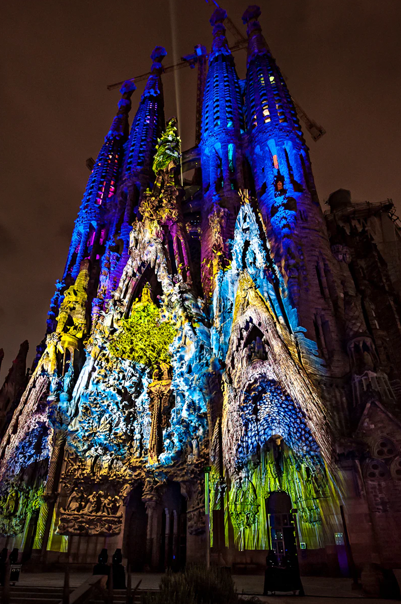

# PAC3_Manovich_Reloaded
## El software transforma la ciutat: Sagrada Família i INTVL

Roger Poquet  
Grau en Multimèdia, UOC  
Cultura Digital

## Introducció
Aquest treball analitza dos casos recents d’hibridació que mostren com el software transforma l’espai físic i urbà. El primer és el videomapping de la Sagrada Família, on una façana arquitectònica es converteix en una pantalla audiovisual. El segon és INTVL, una app de running que converteix la ciutat en un mapa-joc basat en GPS, dades i competició territorial.
Els dos casos són diferents, però comparteixen una mateixa lògica: el món físic és reprogramat per capes digitals. En un cas, el software actua sobre l’arquitectura; en l’altre, sobre el moviment del cos a través de la ciutat.

## Cas 1: Videomapping de la Sagrada Família

*Font: [Moment Factory]([https://sagradafamilia2026.org/en/event/passio-de-passions/](https://momentfactory.com/products/ode-a-la-vie-sagrada-familia))*

El videomapping de la Sagrada Família és un exemple molt clar d’hibridació entre arquitectura, imatge digital, so, animació i experiència col·lectiva. En aquest cas, un edifici patrimonial i religiós, carregat d’història i significat simbòlic, és transformat temporalment en una gran pantalla urbana. La façana deixa de ser només pedra, escultura i arquitectura, i passa a funcionar com una superfície dinàmica on es projecten llum, color, moviment i narració.  
Aquest tipus d’experiència encaixa molt bé amb la mirada de Lev Manovich, especialment amb la idea que el software ha esdevingut un metamitjà capaç d’unir llenguatges que abans funcionaven separadament. En el videomapping no hi ha només una projecció sobre un edifici. Hi ha una combinació de disciplines: disseny visual, animació, música, il·luminació, escenografia, arquitectura i relat. Tot això és coordinat per programari, que calcula com adaptar les imatges a les formes irregulars de la façana i com sincronitzar-les amb el so i el temps de l’espectacle.  
La Sagrada Família és un espai especialment interessant per analitzar aquest fenomen, perquè no és una pantalla neutra. No és una paret blanca preparada per rebre imatges. És una obra arquitectònica amb identitat pròpia, vinculada a Antoni Gaudí i a la ciutat de Barcelona. Per això, quan el software projecta imatges sobre la façana, no simplement la decora: la reinterpreta. El monument continua sent el mateix, però durant uns minuts el veiem d’una altra manera. La capa digital no substitueix l’edifici, sinó que afegeix una nova lectura sobre allò que ja existia.  
També podem entendre aquest cas com una forma de remediació. L’arquitectura, un mitjà antic i material, és reinterpretada a través de llenguatges propis del cinema, l’animació digital i l’espectacle audiovisual. La façana es converteix en una mena de pantalla expandida, però amb una diferència important: la pantalla no és plana, sinó tridimensional, simbòlica i urbana. El públic no mira l’obra dins d’un museu o una sala de cinema, sinó des del carrer, compartint l’experiència amb altres persones. Això dona al mapping una dimensió social i col·lectiva.  
També és important la temporalitat. El videomapping no modifica físicament la Sagrada Família, però sí que transforma la manera com la percebem. És una intervenció efímera: apareix, dura uns minuts i desapareix. Aquesta condició temporal reforça la idea de variabilitat pròpia dels nous mitjans. L’obra no és un objecte estable, sinó un esdeveniment programat.  
En resum, el videomapping de la Sagrada Família mostra com el software pot activar el patrimoni i convertir-lo en una experiència híbrida. L’edifici esdevé alhora monument, pantalla, escenari i relat audiovisual. Aquesta barreja de pedra, llum, música i codi exemplifica molt bé la idea de Manovich: avui els mitjans no desapareixen, sinó que es combinen i es transformen dins del programari.

## Cas 2: INTVL

INTVL és una aplicació de running que transforma una activitat física quotidiana, com sortir a córrer, en una experiència híbrida entre esport, videojoc, mapa digital i competició social. A primera vista podria semblar simplement una app més per registrar rutes, distàncies o ritmes. Però el seu interès està en el fet que afegeix una capa de joc sobre el territori real. L’usuari no només corre: també captura zones, competeix amb altres persones i converteix el seu recorregut en una acció dins d’un mapa interactiu.  
Aquest cas és interessant perquè porta la hibridació de mitjans a un terreny molt quotidià. No estem parlant d’un museu, d’una instal·lació artística o d’un espectacle monumental, sinó d’una pràctica normal del dia a dia. Molta gent utilitza aplicacions per fer esport, registrar passos, controlar la salut o compartir resultats. INTVL aprofita aquesta lògica i la porta cap al llenguatge del videojoc. La ciutat es converteix en un tauler, el GPS funciona com a sensor, el mòbil és la interfície i el cos del corredor es transforma en una font de dades.  
Amb les ulleres de Manovich, INTVL es pot entendre com un exemple de software com a metamitjà. L’aplicació combina cartografia, geolocalització, estadística esportiva, joc, xarxa social i visualització de dades. Cap d’aquests elements és completament nou per separat, però el programari els uneix en una experiència única. Córrer ja no és només moure’s per l’espai físic, sinó participar en un sistema digital que interpreta cada moviment.  
Un dels conceptes més importants aquí és el de base de dades. Cada recorregut genera informació: per on ha passat l’usuari, quina distància ha fet, quines zones ha capturat i quina posició ocupa respecte als altres participants. Aquesta informació no queda com una dada aïllada, sinó que alimenta el funcionament del joc. El moviment físic es converteix en registre, el registre es converteix en puntuació i la puntuació modifica el mapa. Això mostra molt bé com el software reorganitza una experiència real mitjançant dades.  
També podem parlar d’interfície. En INTVL, la interfície no és només la pantalla del mòbil. També ho és la ciutat mateixa. Els carrers, els barris i els recorreguts passen a tenir una doble existència: són espais físics, però també zones digitals que es poden capturar, perdre o disputar. Aquesta fusió entre mapa i territori recorda altres experiències híbrides com Pokémon GO, però aplicada al running i a la competició esportiva.  
La variabilitat és un altre element clau. Cada cursa pot generar un resultat diferent segons la ruta escollida, el temps, la participació d’altres usuaris i l’estat del mapa. L’experiència no és fixa ni igual per a tothom. Depèn de les accions del corredor i de la resposta del sistema.  
En definitiva, INTVL mostra que la hibridació digital no només passa en grans instal·lacions artístiques. També apareix en apps quotidianes que transformen hàbits normals en experiències mediades pel programari. Córrer es converteix en joc, el cos en input, la ciutat en mapa i el moviment en dada. Aquesta és precisament una de les idees més potents de Manovich: el software no només acompanya la cultura contemporània, sinó que la reorganitza des de dins.

## Comparació i conclusions

## Bibliografia

## Llicència

**Llicència:** Creative Commons BY-SA 4.0  
